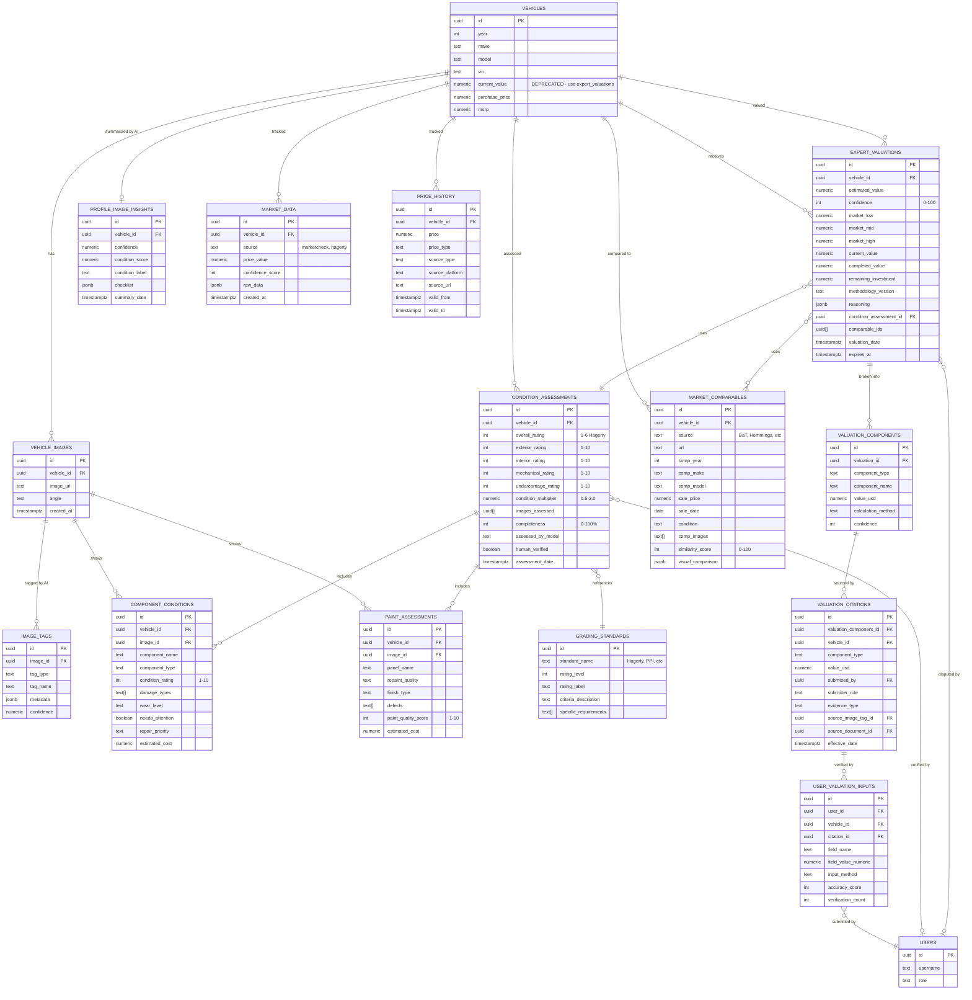

# AI Visual Appraisal System - Consolidated ERD
## Entity Relationship Diagram + Wireframe Explanation

**Goal:** Consolidate 10+ existing valuation/assessment systems into one unified AI visual appraisal pipeline that mimics human expert methodology.

---

## Executive Summary

**Problem:** Multiple overlapping systems for vehicle valuation:
- `vehicle_condition_assessments` (Hagerty scale)
- `component_conditions` (part-level tracking)
- `paint_quality_assessments` (paint-specific)
- `valuation_citations` (source tracking)
- `user_valuation_inputs` (user accuracy)
- `price_history` (market intelligence)
- `profile_image_insights` (AI summary)
- `image_tags` (AI tagging)
- `market_data` (external APIs)
- `VehicleValuationService.ts` (frontend service)

**Solution:** Unified pipeline with clear data flow:
```
Images → AI Analysis → Condition Assessment → Market Research → Expert Valuation → Display
```

---

## System Architecture

### 3-Layer Model

```
┌─────────────────────────────────────────────────────────────┐
│                    PRESENTATION LAYER                        │
│  ┌──────────────┐  ┌──────────────┐  ┌──────────────┐     │
│  │ Vehicle      │  │ Valuation    │  │ Price        │     │
│  │ Header       │  │ Breakdown    │  │ History      │     │
│  │ $115,000     │  │ Visual       │  │ Graph        │     │
│  └──────────────┘  └──────────────┘  └──────────────┘     │
└─────────────────────────────────────────────────────────────┘
                            ▲
                            │
┌─────────────────────────────────────────────────────────────┐
│                   BUSINESS LOGIC LAYER                       │
│                                                              │
│  ┌────────────────────────────────────────────────────┐    │
│  │  Unified Expert Valuation Service                   │    │
│  │  (Replaces VehicleValuationService.ts)             │    │
│  │                                                      │    │
│  │  1. Visual Analysis                                 │    │
│  │  2. Market Research                                 │    │
│  │  3. Expert Synthesis                                │    │
│  └────────────────────────────────────────────────────┘    │
│                                                              │
└─────────────────────────────────────────────────────────────┘
                            ▲
                            │
┌─────────────────────────────────────────────────────────────┐
│                      DATA LAYER                              │
│                                                              │
│  ┌──────────────┐  ┌──────────────┐  ┌──────────────┐     │
│  │ Image        │  │ Condition    │  │ Market       │     │
│  │ Analysis     │  │ Assessments  │  │ Data         │     │
│  └──────────────┘  └──────────────┘  └──────────────┘     │
│                                                              │
│  ┌──────────────┐  ┌──────────────┐  ┌──────────────┐     │
│  │ Valuation    │  │ Citation     │  │ Price        │     │
│  │ Results      │  │ Sources      │  │ History      │     │
│  └──────────────┘  └──────────────┘  └──────────────┘     │
└─────────────────────────────────────────────────────────────┘
```

---

## Consolidated Entity Relationship Diagram

### Core Entities



---

## Data Flow Pipeline

### Step 1: Image Analysis
```
vehicle_images 
    → AI Vision API
    → image_tags (parts, systems detected)
    → component_conditions (per-part condition)
    → paint_assessments (paint quality)
    → profile_image_insights (overall summary)
```

**Tables Written:**
- `image_tags` - AI detects parts, systems, conditions
- `component_conditions` - Rates each component 1-10
- `paint_assessments` - Paint quality per panel
- `profile_image_insights` - Summary checklist

### Step 2: Condition Assessment
```
image_tags + component_conditions + paint_assessments
    → Condition Assessment Engine
    → condition_assessments (Hagerty 1-6 scale)
    → condition_multiplier (0.5x to 2.0x)
```

**Tables Written:**
- `condition_assessments` - Overall Hagerty rating
  - Links to all images analyzed
  - Links to all components found
  - Calculates condition multiplier

### Step 3: Market Research
```
vehicle {year, make, model} + condition_assessment
    → Market Search Engine
    → market_comparables (BaT, Hemmings, etc)
    → similarity_score (visual comparison)
    → market_data (external APIs)
```

**Tables Written:**
- `market_comparables` - Similar vehicles sold recently
  - Includes photos for visual comparison
  - AI rates similarity 0-100%
- `market_data` - MarketCheck, Hagerty, etc.

### Step 4: Expert Valuation
```
condition_assessment + market_comparables + receipts + documents
    → Expert Valuation Engine
    → expert_valuations (final estimate)
    → valuation_components (breakdown)
    → valuation_citations (source tracking)
```

**Tables Written:**
- `expert_valuations` - Final valuation result
  - Current value
  - Completed value (if restoration ongoing)
  - Remaining investment needed
  - Confidence score
  - Value range (low/mid/high)
- `valuation_components` - Breakdown by system
  - Paint: $12,000
  - Interior: $8,000
  - Drivetrain: $25,000
  - etc.
- `valuation_citations` - Source of every dollar
  - Links to receipts, tags, documents
  - Tracks who submitted (owner, mechanic, AI)

### Step 5: User Verification
```
expert_valuations
    → User review
    → user_valuation_inputs (corrections)
    → valuation_citations (updated sources)
    → accuracy tracking
```

**Tables Written:**
- `user_valuation_inputs` - User corrections/additions
- `valuation_citations` - Updated with user evidence
- Feedback loop improves future valuations

### Step 6: Price History
```
expert_valuations
    → price_history (track over time)
    → trend analysis
```

**Tables Written:**
- `price_history` - Every valuation stored
  - Enables trend charts (+7.2% 30D)

---

## Consolidation Strategy

### Tables to KEEP (Core System)

#### 1. Image Analysis Layer
```sql
✅ vehicle_images -- Source images
✅ image_tags -- AI detections
✅ profile_image_insights -- AI summary
✅ component_conditions -- Part-level tracking
✅ paint_assessments -- Paint-specific
```

#### 2. Condition Assessment Layer
```sql
✅ condition_assessments -- Hagerty scale (NEW unified)
✅ grading_standards -- Reference data
```

#### 3. Market Research Layer
```sql
✅ market_comparables -- Similar sales (NEW)
✅ market_data -- External APIs (KEEP)
✅ price_history -- Track over time (KEEP)
```

#### 4. Valuation Layer
```sql
✅ expert_valuations -- Final estimates (NEW replaces VehicleValuationService)
✅ valuation_components -- System breakdown (NEW)
✅ valuation_citations -- Source tracking (KEEP)
```

#### 5. User Verification Layer
```sql
✅ user_valuation_inputs -- User corrections (KEEP)
```

### Tables to DEPRECATE

```sql
❌ vehicles.current_value -- Replaced by expert_valuations.estimated_value
❌ vehicle_value_assessments -- Merged into condition_assessments
❌ valuation_blanks -- No longer needed
```

### Services to CONSOLIDATE

```typescript
❌ VehicleValuationService.ts (nuke_frontend/src/services/)
   → Replace with ExpertValuationService.ts

❌ auto-resto-estimate (supabase/functions/)
   → Merge into unified expert-valuation function

✅ NEW: expert-valuation (supabase/functions/)
   → Single source of truth for all valuations
```

---

## NEW Tables Required

### 1. market_comparables
```sql
CREATE TABLE market_comparables (
  id UUID PRIMARY KEY DEFAULT gen_random_uuid(),
  vehicle_id UUID REFERENCES vehicles(id) ON DELETE CASCADE,
  
  -- Source
  source TEXT NOT NULL, -- 'bring_a_trailer', 'hemmings', 'classic_com', 'cars_and_bids'
  source_url TEXT,
  listing_id TEXT,
  
  -- Comparable vehicle
  comp_year INTEGER,
  comp_make TEXT,
  comp_model TEXT,
  comp_series TEXT,
  comp_vin TEXT,
  
  -- Sale data
  sale_price NUMERIC NOT NULL,
  sale_date DATE,
  bid_count INTEGER,
  
  -- Condition
  condition_description TEXT,
  mileage INTEGER,
  
  -- Visual comparison
  comp_images TEXT[], -- URLs to comparable's photos
  similarity_score INTEGER CHECK (similarity_score BETWEEN 0 AND 100),
  visual_comparison JSONB, -- AI's detailed comparison
  
  -- Metadata
  found_at TIMESTAMPTZ DEFAULT NOW(),
  expires_at TIMESTAMPTZ, -- Cache invalidation
  
  CONSTRAINT unique_vehicle_comparable UNIQUE (vehicle_id, source, listing_id)
);

CREATE INDEX idx_market_comp_vehicle ON market_comparables(vehicle_id);
CREATE INDEX idx_market_comp_similarity ON market_comparables(similarity_score DESC);
```

### 2. expert_valuations
```sql
CREATE TABLE expert_valuations (
  id UUID PRIMARY KEY DEFAULT gen_random_uuid(),
  vehicle_id UUID REFERENCES vehicles(id) ON DELETE CASCADE,
  
  -- Core valuation
  estimated_value NUMERIC NOT NULL,
  confidence INTEGER CHECK (confidence BETWEEN 0 AND 100),
  
  -- Value range
  market_low NUMERIC,
  market_mid NUMERIC,
  market_high NUMERIC,
  
  -- Completion analysis
  current_state_value NUMERIC, -- Value "as-is" now
  completed_value NUMERIC, -- Value when 100% done
  remaining_investment NUMERIC, -- Cost to complete
  completion_percentage INTEGER,
  estimated_timeline TEXT, -- "6 months", "1 year"
  
  -- Methodology
  methodology_version TEXT DEFAULT 'v1_visual_expert',
  condition_assessment_id UUID REFERENCES condition_assessments(id),
  comparable_count INTEGER,
  comparable_ids UUID[], -- References to market_comparables
  
  -- Reasoning (human-readable)
  reasoning TEXT,
  key_factors TEXT[],
  adjustments JSONB, -- [{reason, amount, confidence}]
  
  -- Data sources
  data_sources TEXT[], -- ['AI Vision', 'MarketCheck', 'Receipts', 'BaT Comparables']
  images_analyzed UUID[], -- vehicle_images used
  
  -- Cache/Validity
  valuation_date TIMESTAMPTZ DEFAULT NOW(),
  expires_at TIMESTAMPTZ, -- Re-value after 30 days
  
  -- Verification
  human_verified BOOLEAN DEFAULT false,
  verified_by UUID REFERENCES profiles(id),
  verified_at TIMESTAMPTZ,
  dispute_count INTEGER DEFAULT 0,
  
  created_at TIMESTAMPTZ DEFAULT NOW(),
  updated_at TIMESTAMPTZ DEFAULT NOW()
);

CREATE INDEX idx_expert_val_vehicle ON expert_valuations(vehicle_id);
CREATE INDEX idx_expert_val_date ON expert_valuations(valuation_date DESC);
CREATE INDEX idx_expert_val_expires ON expert_valuations(expires_at) WHERE expires_at > NOW();
```

### 3. valuation_components
```sql
CREATE TABLE valuation_components (
  id UUID PRIMARY KEY DEFAULT gen_random_uuid(),
  valuation_id UUID REFERENCES expert_valuations(id) ON DELETE CASCADE,
  
  -- Component identification
  component_type TEXT NOT NULL, -- 'paint', 'interior', 'drivetrain', 'suspension', etc.
  component_name TEXT, -- Specific: "Front seats", "Engine rebuild", "Suspension lift"
  
  -- Value
  value_usd NUMERIC NOT NULL,
  calculation_method TEXT, -- 'receipt_documented', 'market_adjustment', 'ai_estimate'
  confidence INTEGER CHECK (confidence BETWEEN 0 AND 100),
  
  -- Source linking
  citation_ids UUID[], -- Links to valuation_citations
  image_ids UUID[], -- Images showing this component
  
  -- Quality assessment
  quality_rating INTEGER, -- 1-10
  originality_status TEXT, -- 'original', 'oem_replacement', 'upgraded', 'aftermarket'
  
  created_at TIMESTAMPTZ DEFAULT NOW()
);

CREATE INDEX idx_val_comp_valuation ON valuation_components(valuation_id);
CREATE INDEX idx_val_comp_type ON valuation_components(component_type);
```

---

## Migration Path

### Phase 1: Create New Tables (Week 1)
```sql
-- Run migrations
20251122_market_comparables.sql
20251122_expert_valuations.sql
20251122_valuation_components.sql
```

### Phase 2: Build Edge Function (Week 2)
```typescript
// supabase/functions/expert-valuation/index.ts
serve(async (req) => {
  const { vehicleId } = await req.json();
  
  // Step 1: Visual analysis
  const visualAssessment = await analyzeVehiclePhotos(vehicleId);
  
  // Step 2: Condition assessment
  const conditionRating = await assessCondition(vehicleId, visualAssessment);
  
  // Step 3: Market research
  const comparables = await findMarketComparables(vehicleId, conditionRating);
  
  // Step 4: Expert valuation
  const valuation = await calculateExpertValue(
    vehicleId,
    conditionRating,
    comparables
  );
  
  // Step 5: Save results
  await saveExpertValuation(vehicleId, valuation);
  
  return new Response(JSON.stringify(valuation));
});
```

### Phase 3: Update Frontend Service (Week 3)
```typescript
// Replace VehicleValuationService.ts with ExpertValuationService.ts
export class ExpertValuationService {
  static async getValuation(vehicleId: string) {
    // Check cache
    const cached = await this.getCachedValuation(vehicleId);
    if (cached && !this.isExpired(cached)) return cached;
    
    // Call edge function
    const { data } = await supabase.functions.invoke('expert-valuation', {
      body: { vehicleId }
    });
    
    return data;
  }
}
```

### Phase 4: Migrate Existing Data (Week 4)
```sql
-- Migrate old valuations to new system
INSERT INTO expert_valuations (vehicle_id, estimated_value, confidence, methodology_version)
SELECT 
  id,
  current_value,
  70, -- Default confidence
  'v0_legacy'
FROM vehicles
WHERE current_value IS NOT NULL AND current_value > 0;

-- Mark vehicles.current_value as deprecated
COMMENT ON COLUMN vehicles.current_value IS 'DEPRECATED: Use expert_valuations table instead';
```

---

## Wireframe: Valuation Display

### Vehicle Header (Current Implementation)
```
┌────────────────────────────────────────────────────────────┐
│  1974 Ford Bronco                    Consigner: skylar     │
│                                                             │
│  $115,000  ↑ +7.2% 30D              [VALUATION SERVICE]   │
│  ━━━━━━━━━━━━━━━━━━━━━━━━━━━━━━━━━━━━━━━━━━━━━━━━━━━━━━  │
│                                                             │
│  [Click for breakdown]                                      │
└────────────────────────────────────────────────────────────┘
```

### Expanded Valuation View (New)
```
┌────────────────────────────────────────────────────────────┐
│  Expert Valuation                                           │
│  ━━━━━━━━━━━━━━━━━━━━━━━━━━━━━━━━━━━━━━━━━━━━━━━━━━━━━━  │
│                                                             │
│  Estimated Value: $115,000                                  │
│  Confidence: 85% ●●●●○                                      │
│  Value Range: $97,750 - $132,250                            │
│                                                             │
│  ┌─────────────────────────────────────────────────┐      │
│  │  Visual Assessment (Based on 239 photos)         │      │
│  │  • Build Quality: Professional ⭐⭐⭐⭐⭐          │      │
│  │  • Completion: 90% complete                      │      │
│  │  • Condition Rating: 2 (Excellent - Hagerty)     │      │
│  └─────────────────────────────────────────────────┘      │
│                                                             │
│  ┌─────────────────────────────────────────────────┐      │
│  │  Market Analysis (8 comparables found)           │      │
│  │  • 1973 Bronco - $145k (BaT) - 92% similar       │      │
│  │  • 1974 Bronco - $110k (Hemmings) - 88% similar  │      │
│  │  • 1975 Bronco - $98k (Cars&Bids) - 81% similar  │      │
│  │  [View all comparables →]                         │      │
│  └─────────────────────────────────────────────────┘      │
│                                                             │
│  ┌─────────────────────────────────────────────────┐      │
│  │  Value Breakdown                                  │      │
│  │  ━━━━━━━━━━━━━━━━━━━━━━━━━━━━━━━━━━━━━━━━━━━  │      │
│  │  Base Market Value        $108,000               │      │
│  │  + Paint Quality           +$8,000 (show grade)  │      │
│  │  + Interior Quality        +$5,000 (custom)      │      │
│  │  + Documentation Bonus     +$5,400 (239 photos)  │      │
│  │  - Completion Penalty     -$11,400 (90% done)    │      │
│  │  ━━━━━━━━━━━━━━━━━━━━━━━━━━━━━━━━━━━━━━━━━━━  │      │
│  │  Current Value            $115,000               │      │
│  │  [View detailed breakdown →]                      │      │
│  └─────────────────────────────────────────────────┘      │
│                                                             │
│  ┌─────────────────────────────────────────────────┐      │
│  │  To Completion                                    │      │
│  │  Current Value:    $115,000                       │      │
│  │  Remaining Work:   -$15,000 (est. 3 months)      │      │
│  │  Completed Value:  $125,000                       │      │
│  │  Potential Return: +$10,000                       │      │
│  └─────────────────────────────────────────────────┘      │
│                                                             │
│  Data Sources: AI Vision Analysis, MarketCheck,           │
│  Bring a Trailer (8 sales), Hagerty Standards              │
│                                                             │
│  Last Updated: Nov 22, 2025 • Expires: Dec 22, 2025        │
│  [Request new appraisal] [Dispute valuation]               │
└────────────────────────────────────────────────────────────┘
```

---

## Benefits of Consolidation

### 1. Single Source of Truth
- ONE table for valuations: `expert_valuations`
- ONE service: `ExpertValuationService`
- ONE edge function: `expert-valuation`
- Clear data lineage

### 2. Full Transparency
- Every dollar traced to source (`valuation_citations`)
- Visual evidence for every assessment (`images_analyzed`)
- Market comparables with similarity scores
- Human-readable reasoning

### 3. Accuracy Improvement
- Uses actual market data (BaT, Hemmings)
- AI visual analysis (professional vs DIY)
- Industry standards (Hagerty 1-6 scale)
- User verification loop

### 4. Completion Analysis
- Current "as-is" value
- Completed value (when 100% done)
- Remaining investment needed
- Realistic timeline estimate

### 5. Cache & Performance
- Valuations expire after 30 days
- Re-uses condition assessments
- Market comps cached 7 days
- Incremental updates

---

## Implementation Checklist

- [ ] Create `market_comparables` table
- [ ] Create `expert_valuations` table
- [ ] Create `valuation_components` table
- [ ] Build `expert-valuation` edge function
  - [ ] Visual analysis module
  - [ ] Market research module
  - [ ] Condition assessment module
  - [ ] Expert synthesis module
- [ ] Create `ExpertValuationService.ts` frontend service
- [ ] Update `VehicleHeader.tsx` to use new service
- [ ] Build valuation breakdown UI component
- [ ] Migrate existing `vehicles.current_value` data
- [ ] Deprecate old `VehicleValuationService.ts`
- [ ] Add user dispute/verification flow
- [ ] Test on 10 vehicles (various conditions)
- [ ] Deploy to production

---

## Example: 1974 Ford Bronco Flow

### Input
```
Vehicle ID: [bronco_uuid]
Images: 239 photos
Year: 1974
Make: Ford
Model: Bronco
```

### Step 1: Visual Analysis
```json
{
  "buildQuality": "professional",
  "completionLevel": 90,
  "systemsAssessed": {
    "paint": { "quality": "show_quality", "cost": 12000 },
    "interior": { "quality": "custom_professional", "cost": 8000 },
    "suspension": { "quality": "professional_lift", "cost": 10000 },
    "drivetrain": { "quality": "rebuilt", "cost": 25000 }
  },
  "notableFeatures": [
    "Custom leather interior",
    "Professional lift kit",
    "Show-quality paint",
    "Custom bumpers"
  ],
  "estimatedInvestment": 70000,
  "qualityMultiplier": 1.15
}
```

### Step 2: Condition Assessment
```json
{
  "overall_rating": 2, // Excellent (Hagerty)
  "exterior_rating": 9,
  "interior_rating": 9,
  "mechanical_rating": 8,
  "condition_multiplier": 1.15
}
```

### Step 3: Market Research
```json
{
  "comparables": [
    {
      "source": "bring_a_trailer",
      "sale_price": 145000,
      "sale_date": "2025-10-15",
      "similarity_score": 92
    },
    {
      "source": "hemmings",
      "sale_price": 110000,
      "sale_date": "2025-09-22",
      "similarity_score": 88
    }
  ],
  "base_market_value": 108000
}
```

### Step 4: Expert Valuation
```json
{
  "estimated_value": 115000,
  "confidence": 85,
  "market_low": 97750,
  "market_mid": 115000,
  "market_high": 132250,
  "current_state_value": 115000,
  "completed_value": 125000,
  "remaining_investment": 15000,
  "reasoning": "Professional build quality with show-grade paint..."
}
```

### Result
**Display: $115,000 ↑ +7.2% 30D** instead of **$10,988**

---

## Conclusion

This consolidated ERD unifies 10+ existing systems into one coherent AI visual appraisal pipeline that:
1. Analyzes photos like a human expert
2. Researches real market comparables
3. Applies industry-standard grading
4. Provides transparent, citeable valuations
5. Tracks accuracy and improves over time

**Next Step:** Approve this ERD and begin Week 1 implementation (create new tables).

