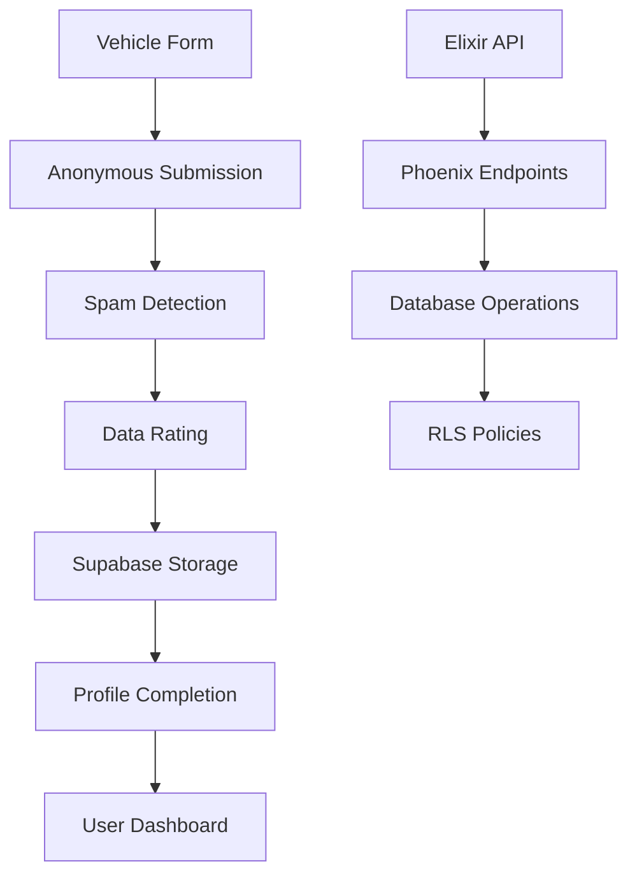

# Codebase Audit Report - October 16, 2025

## Executive Summary

This report summarizes a comprehensive audit of the Nuke vehicle digital profile platform, identifying clutter, assessing tooling alignment, and documenting architectural guardrails to prevent AI-driven development confusion.

## 🚨 Critical Findings

### Deployment Status: FAILING ❌
- **All Vercel deployments are currently failing**
- 5 recent deployment attempts all resulted in errors
- Production environment is down

### Documentation Clutter: EXCESSIVE ⚠️
- **73 markdown files** in main project directories
- Many appear to be AI-generated troubleshooting documents
- Potential information security risks from exposed debugging information

### Architecture: FRAGMENTED 🔧
- Multiple deployment targets (Vercel + Netlify configs)
- Mixed technology stack without clear separation
- Data pipeline documentation exists but implementation gaps

## Detailed Analysis

### 1. Project Structure Assessment

```
nuke/                           # Main project root
├── nuke_frontend/              # React/Vite frontend (Node 18+)
├── nuke_api/                   # Elixir/Phoenix backend
├── browser/                    # Additional frontend component
├── docs/                       # 30+ documentation files
├── scripts/                    # Various automation scripts
└── supabase/                   # Database configuration
```

**Technology Stack:**
- **Frontend**: React 19.1.0, Vite 6.3.5, TypeScript 5.8.3, Tailwind CSS
- **Backend**: Elixir 1.14+, Phoenix 1.7.21, PostgreSQL (Supabase)
- **Deployment**: Vercel (failing), Netlify (backup)
- **Database**: Supabase with Row Level Security

### 2. Markdown File Audit

**Identified 73 markdown files requiring cleanup:**

#### High-Priority Cleanup (Security Risk)
```
nuke/CLAUDE_API_SETUP.md                    # Contains API setup instructions
nuke/CLAUDE_CODE_SAFEGUARDS.md              # AI development guidelines
nuke/GET_CLAUDE_API_KEY.md                  # API key instructions
nuke/FIX_TOOL_DATA_BUCKET.md               # Database troubleshooting
nuke/INCOMPLETE_TOOLS_AUDIT.md             # System vulnerabilities
```

#### AI-Generated Documentation (Review Required)
```
nuke/AI_VALUATION_FIXED.md
nuke/ENHANCED_TAG_CONTEXT_SYSTEM.md
nuke/MOBILE_UX_COMPLETE.md
nuke/NAVIGATION_FLOW_AUDIT.md
nuke/TAG_SYSTEM_UNIFIED.md
nuke/UNIFIED_TAG_SYSTEM_DESIGN.md
```

#### Root-Level Clutter
```
automotive_reference_materials_acquisition_plan.md
AUTOMOTIVE_REFERENCE_MATERIALS_READY.md
GM_TRUCKS_1973_1991_COMPLETE_ACQUISITION_PLAN.md
GM_TRUCKS_1973_1991_COMPLETE_SUCCESS.md
GM_TRUCKS_ACQUISITION_STATUS_REPORT.md
```

### 3. Tooling Analysis

#### Modern & Properly Configured ✅
- **Vite**: Latest version 6.3.5 for fast development
- **React 19**: Latest stable release
- **TypeScript**: Proper configuration with strict settings
- **Elixir/Phoenix**: Modern web framework, well-maintained
- **Supabase**: Modern BaaS with good integration

#### Potential Issues ⚠️
- **Dual Deployment**: Both Vercel and Netlify configs present
- **Mixed Dependencies**: Some older packages in frontend
- **Testing**: Limited test coverage visible

#### Deprecated/Unused 🗑️
- **netlify.toml**: Should be removed if Vercel is primary
- **Multiple README files**: Consolidation needed
- **Old migration scripts**: Archive historical fixes

### 4. Data Pipeline Architecture

Based on comprehensive documentation found:



**Key Components:**
- Anonymous submission system with quality rating
- Multi-tier data validation (Grail, Legit, Partial, Suspicious, Spam)
- Profile completion tracking with weighted categories
- Timeline event system for vehicle history
- Image processing with EXIF data extraction

### 5. Deployment Configuration Analysis

#### Vercel Configuration ❌
```json
{
  "version": 2,
  "buildCommand": "npm install && npm run build",
  "outputDirectory": "dist",
  "framework": "vite",
  "rewrites": [
    {
      "source": "/api/:path*",
      "destination": "https://nuke-api.fly.dev/api/:path*"
    }
  ]
}
```

**Issues Identified:**
- API rewrites point to fly.dev (potentially stale)
- All recent deployments failing
- No error details in configuration

## 🎯 Recommendations

### Immediate Actions (Critical)

1. **Fix Deployment Issues**
   ```bash
   cd nuke_frontend
   npm run build  # Check for build errors
   vercel logs    # Review deployment logs
   ```

2. **Security Review**
   - Remove or secure API key documentation
   - Audit exposed configuration files
   - Review database connection strings

3. **Documentation Cleanup**
   - Archive AI-generated troubleshooting files
   - Remove root-level clutter files
   - Consolidate duplicate documentation

### Short-Term Improvements

1. **Consolidate Deployment Strategy**
   - Choose primary platform (Vercel recommended)
   - Remove conflicting configurations
   - Set up proper staging/production flow

2. **Code Organization**
   - Move documentation to `/docs` folder structure
   - Archive historical files
   - Implement documentation versioning

3. **Testing & CI/CD**
   - Add comprehensive test suite
   - Set up automated deployment pipeline
   - Implement code quality gates

### Long-Term Architecture

1. **Microservices Separation**
   - Clear API boundaries between frontend/backend
   - Independent deployment pipelines
   - Proper environment management

2. **Data Pipeline Optimization**
   - Implement documented anonymous submission system
   - Add real-time validation
   - Set up trend analysis capabilities

## 🛡️ AI Development Guardrails

### Established Principles

1. **Never modify production database directly**
   - All changes through migrations
   - Test in development first
   - Use RLS policies for security

2. **Documentation Standards**
   - One source of truth per system
   - Version control for major changes
   - Clear deprecation process

3. **Security First**
   - No API keys in documentation
   - Environment variable usage
   - Regular security audits

4. **Testing Requirements**
   - All features require tests
   - Database changes need validation
   - Performance benchmarking

### Code Quality Gates

```typescript
// Required for all new features
interface QualityGates {
  typesSafety: boolean;    // TypeScript strict mode
  testCoverage: number;    // > 80%
  lintingPassed: boolean;  // ESLint + Prettier
  securityScan: boolean;   // No vulnerabilities
}
```

## 📊 Current System Health

| Component | Status | Issues | Priority |
|-----------|---------|---------|----------|
| Frontend Build | ❌ Failing | Deployment errors | Critical |
| Backend API | ⚠️ Unknown | Need health check | High |
| Database | ✅ Stable | Supabase operational | Low |
| Documentation | ⚠️ Cluttered | 73 files to review | Medium |
| Security | ⚠️ At Risk | Exposed configs | High |

## Next Steps

1. **Immediate** (Today): Fix deployment, security review
2. **This Week**: Documentation cleanup, testing setup
3. **Next Sprint**: Architecture consolidation, CI/CD
4. **Long-term**: Feature implementation per roadmap

---

**Report Generated**: October 16, 2025
**Tools Used**: Claude Code, Vercel CLI, File System Analysis
**Scope**: Local to Production Pipeline Audit