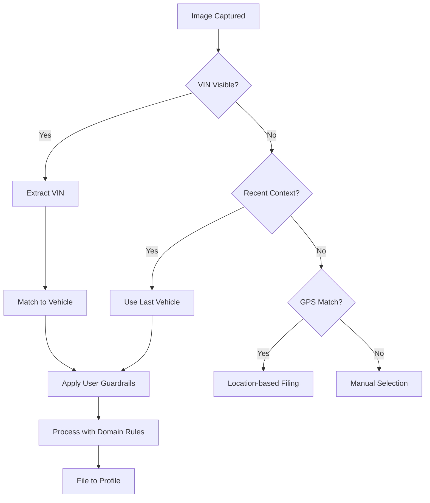

# AI Guardrails Architecture for Intelligent Image Processing

## Executive Summary

AI Guardrails are the intelligent boundaries that shape how our AI systems process, understand, and file images within the context of each user's unique workflow. These guardrails ensure that AI assistance remains helpful, accurate, and aligned with user intentions while preventing hallucination and maintaining data integrity.

## Core Concept: User-Specific Intelligence Boundaries

### What Are AI Guardrails?

AI Guardrails are configurable parameters and rules that define:
1. **Processing Boundaries** - What the AI should and shouldn't infer from images
2. **Context Awareness** - How deeply the AI should understand the user's domain
3. **Filing Logic** - How images should be automatically categorized and stored
4. **Privacy Limits** - What information should remain private or be redacted
5. **Inference Depth** - How far the AI should go in making connections

## The Three-Layer Guardrail System

### Layer 1: Personal Context Guardrails (User Profile Layer)
These guardrails are specific to each user's role, expertise, and workflow:

```typescript
interface PersonalGuardrails {
  // User's professional context
  profession: 'mechanic' | 'dealer' | 'enthusiast' | 'collector';
  expertise_areas: string[]; // ['engine_rebuild', 'electrical', 'bodywork']
  
  // Work patterns
  typical_work_scenarios: string[]; // ['customer_vehicle', 'personal_project', 'inventory']
  preferred_filing_structure: FilingPreference;
  
  // Privacy settings
  customer_data_handling: 'blur_plates' | 'encrypt_vin' | 'full_privacy';
  location_sharing: 'never' | 'work_only' | 'always';
}
```

### Layer 2: Domain Intelligence Guardrails (Knowledge Layer)
These define how deeply the AI should analyze based on the user's domain:

```typescript
interface DomainGuardrails {
  // Recognition depth
  part_identification: {
    level: 'basic' | 'intermediate' | 'expert';
    include_part_numbers: boolean;
    cross_reference_catalogs: boolean;
    estimate_condition: boolean;
  };
  
  // Context understanding
  work_stage_detection: boolean; // Detect if it's disassembly, repair, assembly
  problem_diagnosis: boolean; // Identify potential issues from visual cues
  progress_tracking: boolean; // Track work progress across photo sessions
  
  // Inference boundaries
  make_cost_estimates: boolean;
  suggest_next_steps: boolean;
  identify_safety_concerns: boolean;
}
```

### Layer 3: Organizational Guardrails (Workflow Layer)
These ensure proper filing and organization:

```typescript
interface OrganizationalGuardrails {
  // Auto-filing rules
  filing_triggers: {
    detect_vin_in_image: boolean;
    match_recent_context: boolean; // File to most recent vehicle worked on
    use_gps_location: boolean; // File based on work location
    analyze_visible_vehicles: boolean;
  };
  
  // Categorization logic
  auto_categorization: {
    by_work_type: boolean; // 'diagnosis', 'repair', 'documentation'
    by_component: boolean; // 'engine', 'transmission', 'body'
    by_angle: boolean; // 'overview', 'detail', 'before/after'
    by_quality: boolean; // 'reference', 'progress', 'final'
  };
  
  // Timeline integration
  timeline_creation: {
    auto_create_events: boolean;
    batch_similar_photos: boolean;
    extract_work_narrative: boolean;
  };
}
```

## Implementation: Rapid Mobile Capture Flow

### 1. Instant Capture Mode
```typescript
interface RapidCaptureFlow {
  // Pre-capture context
  getCurrentContext(): {
    last_vehicle_viewed: string;
    active_work_session: string;
    gps_location: Coordinates;
    time_since_last_photo: number;
  };
  
  // During capture
  liveGuidance: {
    show_alignment_guides: boolean;
    suggest_angles: string[]; // Based on what's already captured
    highlight_missing_coverage: boolean;
  };
  
  // Post-capture processing
  immediateProcessing: {
    extract_visible_text: boolean; // VINs, part numbers
    detect_primary_subject: boolean;
    assess_image_quality: boolean;
    apply_guardrails: boolean;
  };
}
```

### 2. Intelligent Filing Decision Tree



### 3. User-Specific Processing Examples

#### Mechanic Profile Guardrails:
```javascript
const mechanicGuardrails = {
  personal: {
    profession: 'mechanic',
    expertise_areas: ['diagnosis', 'repair', 'maintenance'],
    typical_scenarios: ['customer_repair', 'diagnostic_work'],
    privacy: 'blur_customer_plates'
  },
  domain: {
    part_identification: { level: 'expert', include_part_numbers: true },
    work_stage_detection: true,
    problem_diagnosis: true,
    identify_safety_concerns: true
  },
  organizational: {
    filing_triggers: { detect_vin_in_image: true, match_recent_context: true },
    auto_categorization: { by_work_type: true, by_component: true },
    timeline_creation: { auto_create_events: true, extract_work_narrative: true }
  }
};
```

#### Dealer Profile Guardrails:
```javascript
const dealerGuardrails = {
  personal: {
    profession: 'dealer',
    expertise_areas: ['inventory', 'condition_assessment', 'sales'],
    typical_scenarios: ['inventory_documentation', 'listing_photos'],
    business_info: { name: 'Viva! Las Vegas Autos', license: 'DLR000053625' }
  },
  domain: {
    part_identification: { level: 'basic' },
    condition_assessment: true,
    market_value_indicators: true,
    detail_highlighting: true
  },
  organizational: {
    filing_triggers: { detect_vin_in_image: true, use_gps_location: true },
    auto_categorization: { by_angle: true, by_quality: true },
    batch_processing: { group_by_session: true, create_listing_sets: true }
  }
};
```

## AI Processing Pipeline with Guardrails

### 1. Image Ingestion
```typescript
async function processImageWithGuardrails(image: File, userGuardrails: UserGuardrails) {
  // Step 1: Apply personal privacy guardrails
  const sanitizedImage = await applyPrivacyFilters(image, userGuardrails.personal.privacy);
  
  // Step 2: Extract context based on domain guardrails
  const imageContext = await extractContext(sanitizedImage, userGuardrails.domain);
  
  // Step 3: Determine filing location using organizational guardrails
  const filingDecision = await determineFilingLocation(imageContext, userGuardrails.organizational);
  
  // Step 4: Process according to all three layers
  return await processWithFullContext(sanitizedImage, imageContext, filingDecision, userGuardrails);
}
```

### 2. Context Extraction with Boundaries
```typescript
async function extractContext(image: ProcessedImage, domainRules: DomainGuardrails) {
  const context: ImageContext = {
    visible_text: [],
    detected_objects: [],
    work_stage: null,
    quality_assessment: null
  };
  
  // Only extract what guardrails allow
  if (domainRules.part_identification.level !== 'none') {
    context.detected_objects = await identifyParts(image, domainRules.part_identification.level);
  }
  
  if (domainRules.work_stage_detection) {
    context.work_stage = await detectWorkStage(image);
  }
  
  // Respect inference boundaries
  if (domainRules.problem_diagnosis && context.detected_objects.length > 0) {
    context.potential_issues = await diagnoseProblem(context.detected_objects);
  }
  
  return context;
}
```

### 3. Intelligent Filing with Learning
```typescript
class AdaptiveFilingSystem {
  private userPatterns: Map<string, FilingPattern> = new Map();
  
  async fileImage(image: ProcessedImage, context: ImageContext, rules: OrganizationalGuardrails) {
    // Learn from user corrections
    const historicalPattern = this.userPatterns.get(context.userId);
    
    // Apply filing triggers in priority order
    let filingTarget: FilingTarget | null = null;
    
    if (rules.filing_triggers.detect_vin_in_image && context.visible_text.includes('vin')) {
      filingTarget = await this.matchVINToVehicle(context.visible_text);
    }
    
    if (!filingTarget && rules.filing_triggers.match_recent_context) {
      filingTarget = await this.matchRecentContext(context.userId);
    }
    
    if (!filingTarget && rules.filing_triggers.use_gps_location) {
      filingTarget = await this.matchByLocation(context.gps);
    }
    
    // Apply categorization
    if (filingTarget) {
      const category = await this.determineCategory(image, context, rules.auto_categorization);
      return { target: filingTarget, category };
    }
    
    // Fallback to user selection with smart suggestions
    return this.promptUserWithSuggestions(context, historicalPattern);
  }
}
```

## Mobile-Specific Optimizations

### 1. Offline-First Processing
```typescript
interface OfflineCapableGuardrails {
  // Local processing capabilities
  offline_capabilities: {
    basic_text_extraction: boolean; // OCR for VINs
    edge_ai_classification: boolean; // On-device ML
    pattern_matching: boolean; // Recent work patterns
  };
  
  // Sync behavior
  sync_strategy: {
    immediate_sync: boolean;
    batch_on_wifi: boolean;
    priority_queue: boolean; // Important images first
  };
}
```

### 2. Progressive Enhancement
```typescript
class ProgressiveImageProcessor {
  async processImage(image: File, guardrails: UserGuardrails) {
    // Immediate local processing
    const quickResults = await this.localQuickProcess(image);
    
    // Show immediate feedback
    this.showQuickFeedback(quickResults);
    
    // Queue for full processing
    const fullProcessingPromise = this.queueForFullProcessing(image, guardrails);
    
    // Update UI progressively as results come in
    fullProcessingPromise.then(results => {
      this.updateWithFullResults(results);
    });
  }
}
```

## Privacy and Security Guardrails

### 1. Data Sanitization
```typescript
interface PrivacyGuardrails {
  // What to redact
  redaction_rules: {
    license_plates: 'blur' | 'remove' | 'none';
    faces: 'blur' | 'remove' | 'none';
    documents: 'ocr_only' | 'blur_sensitive' | 'none';
    customer_info: 'encrypt' | 'redact' | 'none';
  };
  
  // Where data can go
  data_boundaries: {
    local_only: string[]; // Fields that never leave device
    encrypted_only: string[]; // Fields that must be encrypted
    shareable: string[]; // Fields that can be shared
  };
}
```

### 2. Compliance Framework
```typescript
interface ComplianceGuardrails {
  // Regional compliance
  gdpr_compliance: boolean;
  ccpa_compliance: boolean;
  
  // Industry compliance
  automotive_standards: string[]; // ['iso_26262', 'autosar']
  
  // Data retention
  retention_policies: {
    customer_images: number; // days
    diagnostic_data: number;
    anonymization_period: number;
  };
}
```

## Learning and Adaptation

### 1. Pattern Recognition
The system learns from user behavior to improve guardrails:

```typescript
class GuardrailLearningSystem {
  async learnFromCorrection(original: FilingDecision, correction: FilingDecision) {
    // Update user patterns
    await this.updateUserPattern(correction.userId, {
      context: original.context,
      original_decision: original,
      user_correction: correction,
      timestamp: new Date()
    });
    
    // Adjust guardrail weights
    await this.adjustGuardrailWeights(correction.userId, original, correction);
    
    // Update domain knowledge if pattern emerges
    if (await this.isEmergingPattern(correction)) {
      await this.suggestGuardrailUpdate(correction);
    }
  }
}
```

### 2. Continuous Improvement
```typescript
interface GuardrailMetrics {
  // Accuracy metrics
  filing_accuracy: number; // % correctly filed first time
  context_recognition: number; // % correct context detection
  user_satisfaction: number; // Based on corrections
  
  // Efficiency metrics
  processing_time: number;
  user_interaction_required: number; // Lower is better
  
  // Adaptation metrics
  pattern_stability: number; // How consistent are user patterns
  guardrail_effectiveness: number; // How well guardrails predict behavior
}
```

## Implementation Roadmap

### Phase 1: Core Mobile Capture (Week 1-2)
- Implement rapid camera access button
- Basic VIN/text extraction
- Simple filing to recent vehicle
- Offline queue management

### Phase 2: Intelligent Processing (Week 3-4)
- Implement three-layer guardrail system
- Add domain-specific intelligence
- GPS and context-based filing
- Progressive enhancement

### Phase 3: Learning System (Week 5-6)
- Pattern recognition implementation
- User correction learning
- Guardrail weight adjustment
- Metrics and monitoring

### Phase 4: Advanced Features (Week 7-8)
- Collaborative intelligence (learning across users)
- Advanced privacy controls
- Compliance framework
- Performance optimization

## Conclusion

AI Guardrails transform chaotic image capture into intelligent, organized documentation. By understanding each user's unique context, expertise, and workflow, the system provides powerful automation while maintaining control and privacy. The three-layer approach ensures that AI assistance remains helpful without overstepping boundaries, creating a system that gets smarter and more personalized with every use.