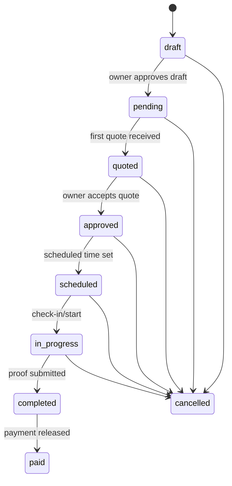
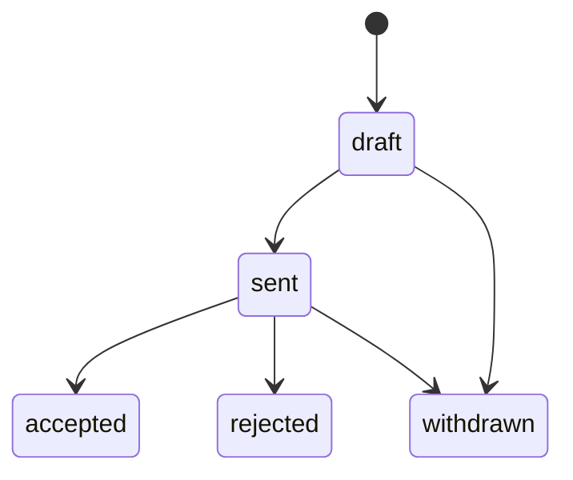

### Messaging-First Work Pipeline (Owner ↔ Technician)

This is the system spec for turning vehicle work into a **messaging-native** execution pipeline:
- The **mailbox thread is the workspace**
- The UI is **work order formation + confirmation + execution status**
- Every action creates structured data for:
  - **Work execution**
  - **User activity**
  - **Vehicle change scoring**
  - **Technician reputation + availability**

---

### Glossary (canonical terms)
- **Work order**: a structured request (routable, quotable, payable). DB: `work_orders`
- **Work item**: owner planning list items derived from messages and/or work orders. DB: `vehicle_work_items`
- **Mailbox message**: the communication stream + workflow event log. DB: `mailbox_messages`
- **Quote**: bid/estimate for a work order. DB: `work_order_quotes`
- **Assignment**: technician/org accepts responsibility to deliver the work order. (proposed table)
- **Funds committed**: owner credibility signal; later becomes actual escrow/hold. Message type: `funds_committed`

---

## Owner UX: vehicle mailbox as the “work execution console”

### Inbox layout (wireframe)

```text
┌──────────────────────────────────────────────────────────────────────────────┐
│ Vehicle: {nickname / YMM / VIN}                    [Search] [Filters]        │
├───────────────┬───────────────────────────────────────────┬─────────────────┤
│ Folders       │ Thread (messages + workflow cards)         │ Right panel     │
│ - Inbox       │                                           │ (selected item) │
│ - Work        │  [USER] "Need undercarriage patched..."    │                 │
│ - Quotes      │  [SYSTEM CARD] Work Order Draft            │  Work Order     │
│ - Receipts    │    - title, deliverables, urgency          │  - status       │
│ - Completed   │    - required photos + notes               │  - quotes list  │
│               │    [Approve] [Edit] [Add photos]           │  - accept quote │
│               │                                           │  - payment hold │
│               │  [QUOTE CARD] {org/tech} $1500, 6 hrs      │                 │
│               │    [View details] [Accept] [Ask changes]   │                 │
│               │                                           │                 │
│               │  [STATUS] "Scheduled Fri 2pm"              │                 │
│               │  [PROOF] Before/After + timelapse link     │                 │
│               │  [RECEIPT] parsed receipt + line items     │                 │
├───────────────┴───────────────────────────────────────────┴─────────────────┤
│ Composer: “Describe what you need done…”  [Attach] [Commit funds] [Send]     │
└──────────────────────────────────────────────────────────────────────────────┘
```

### Composer modes (no extra screens)
The composer can emit:
- **Free message** (`user_message` / `comment`)
- **Work request** (`work_request`)
- **Draft work order** (creates `work_orders` + `work_order` mailbox message)
- **Funds committed** signal (adds `funds_committed` mailbox message; later becomes escrow)

UI rule:
- The user always types in one box; mode is inferred or chosen with a small toggle.

---

## Technician UX: work inbox + evaluation + accept

### Technician inbox (wireframe)

```text
┌──────────────────────────────────────────────────────────────────────────────┐
│ Work Inbox                               [Availability] [Service area]       │
├───────────────┬──────────────────────────────────────────────────────────────┤
│ Folders       │ Opportunities (sorted by fit + time)                          │
│ - Suggested   │  Work Order: "Undercarriage patch"                            │
│ - Invited     │   - location: on-site, due: 5 days                            │
│ - Active      │   - owner signal: funds committed                             │
│ - Completed   │   - required proof: timelapse + after photos                  │
│               │   - vehicle context: images + inspection notes                │
│               │   [Request details] [Send quote] [Decline]                    │
│               │                                                               │
│               │  (Selecting opens a message thread with owner/system)         │
└───────────────┴──────────────────────────────────────────────────────────────┘
```

Technician reads a work order as:
- A **structured card**
- With a **supporting message thread** for negotiation and clarifications

---

## Workflow state machines

### Work order state machine (canonical)



### Quote state machine



---

## Data writes: every action has a save path

### Sequence: message → draft work order → quote → accept → completion

```mermaid
sequenceDiagram
  participant Owner
  participant UI as Mailbox UI
  participant API as Phoenix API
  participant DB as Postgres/Supabase
  participant Tech

  Owner->>UI: Send "Need X done..."
  UI->>API: POST /mailbox/messages (work_request)
  API->>DB: insert mailbox_messages(work_request)

  Owner->>UI: Draft Work Order
  UI->>API: POST /mailbox/work-orders/draft
  API->>DB: insert mailbox_messages(work_request)
  API->>DB: insert work_orders(status=draft)
  API->>DB: insert mailbox_messages(work_order, metadata.work_order_id)
  API-->>UI: returns work_order + messages

  Note over Owner,DB: Drafting does NOT write timeline events.

  Owner->>UI: Publish / Make Available
  UI->>API: POST /mailbox/work-orders/:id/publish
  API->>DB: update work_orders(status=pending, is_published=true, visibility=…)
  API->>DB: insert mailbox_messages(status_update)
  Note over API,DB: Publishing is the point where timeline writes begin.

  Tech->>UI: Send Quote
  UI->>API: POST /work-orders/:id/quotes
  API->>DB: insert work_order_quotes(status=sent)
  API->>DB: insert mailbox_messages(quote, metadata.work_order_quote_id)
  Note over Owner,DB: Quote reception is work-order metrics (not vehicle timeline).

  Owner->>UI: Accept Quote
  UI->>API: POST /quotes/:id/accept
  API->>DB: update quote accepted, reject others
  API->>DB: update work_orders.status=approved
  API->>DB: insert mailbox_messages(acceptance)
  API->>DB: upsert vehicle_user_permissions(role=mechanic, expires_at, context=work_order)
  API->>DB: upsert mailbox_access_keys(temporary read_write, expires_at, conditions.work_order_id)
  Note over Owner,DB: Accepting a quote grants the technician time-bounded access needed for proof uploads.

  Tech->>UI: Submit proof + completion
  UI->>API: POST /proofs
  API->>DB: insert work_order_proofs
  API->>DB: insert mailbox_messages(status_update)
  API->>DB: insert vehicle_timeline_event(Work proof uploaded)

  Tech->>UI: Request completion
  UI->>API: POST /complete-request
  API->>DB: insert mailbox_messages(work_completed, completion_request=true)
  Note over Owner,DB: This is only a request; no work_orders.status change and no timeline event.

  Owner->>UI: Finalize completion
  UI->>API: POST /complete
  API->>DB: validate deliverables present (if required)
  API->>DB: update work_orders.status=completed
  API->>DB: insert mailbox_messages(work_completed)
  API->>DB: insert vehicle_timeline_event(Work completed)
```

---

## Proof access key lifecycle (implementation)

When the owner approves work (quote accepted → `work_orders.status=approved`):
- Grant the technician:
  - **Vehicle profile access + upload rights** via `vehicle_user_permissions`
    - `role = mechanic`
    - `is_active = true`
    - `expires_at = now() + 30 days` (default; can be tuned per work order)
    - `context = "work_order:{work_order_id}"`
  - **Mailbox thread access** via `mailbox_access_keys`
    - `relationship_type = service_provider`
    - `permission_level = read_write`
    - `key_type = temporary`
    - `expires_at` matches `vehicle_user_permissions.expires_at`
    - `conditions = { scope: "work_order", work_order_id }`

Revocation:
- Set `vehicle_user_permissions.is_active=false`, `revoked_at`, `revoked_by`
- Set `mailbox_access_keys.expires_at=now()` (or delete)

Auto-revocation (correctness rule):
- When the owner **finalizes completion** (`POST /complete`):
  - automatically revoke any technician proof access scoped to `work_order:{id}`
  - this prevents lingering write access after the work is complete

---

## Proof submission + completion (MVP)

Proof submission is a timeline event **only when a work order is available** (published/approved) and a contributor/tech has been granted access.

### Proof artifacts
- Stored in `work_order_proofs`
  - `proof_type`: `before_photos`, `after_photos`, `timelapse`, `receipt`, `note`, `other`
  - `urls[]` and optional `notes`

### Mailbox messages emitted
- On proof upload:
  - `mailbox_messages.status_update` with metadata `{ work_order_id, work_order_proof_id, proof_type, urls[] }`
- On completion:
  - `mailbox_messages.work_completed` with metadata `{ work_order_id }`

### Timeline events emitted
- On proof upload: `service` event titled `Work proof uploaded` (metadata includes `work_order_id` + `work_order_proof_id`)
- On completion: `service` event titled `Work completed` (metadata includes `work_order_id`)

---

## Deliverables enforcement (completion gating)

Work orders can optionally declare required proof deliverables on the work order itself:
- `work_orders.metadata.deliverables = [ ... ]`
- Values must be from the canonical `proof_type` set:
  - `before_photos`, `after_photos`, `timelapse`, `receipt`, `note`, `other`

Completion behavior:
- `POST /complete` is **blocked** unless:
  - work order is **published** (`is_published = true`)
  - work order `status` is one of: `pending | approved | scheduled | in_progress`
  - all `metadata.deliverables[]` are satisfied by at least one `work_order_proofs` row with:
    - `proof_type = deliverable`
    - and either `urls[]` has at least 1 entry OR `notes` is non-empty
- If missing deliverables, API returns **409** with:
  - `missing_deliverables: string[]`


---

## Database design (current + proposed extensions)

### Existing (already in repo)
- `vehicle_mailboxes`
- `mailbox_access_keys`
- `mailbox_messages`
- `work_orders`
- `work_order_quotes`
- `vehicle_work_items`
- `vehicle_work_item_holds`

### Proposed: technician discovery + trust + availability

#### 1) Technician identity + skill model
Goal: “find the right guy” must be queryable and provable.

**Tables**
- `technician_profiles`
  - `user_id` (pk/fk), `display_name`, `bio`, `home_base` (geo), `travel_radius_km`, `primary_trade`, `tools` (jsonb)
- `technician_skills`
  - `id`, `user_id`, `skill_key` (e.g. `body_work.patch_panel`), `level` (1–5), `source` (`self_claimed|verified|inferred`)
- `skill_evidence`
  - `id`, `user_id`, `skill_key`, `evidence_type` (`receipt|image|review|cert|work_history`)
  - `vehicle_id`, `work_order_id`, `receipt_id`, `image_id`, `url`, `metadata`
- `technician_credentials`
  - `id`, `user_id`, `credential_type`, `issuer`, `issued_at`, `expires_at`, `verification_status`

**Core rule**
- Matching uses `verified` and `inferred` skills by default; `self_claimed` boosts only if other signals exist.

#### 2) Availability model
Goal: match on “who can do it soon” with real constraints.

**Tables**
- `technician_availability_windows`
  - `id`, `user_id`, `start_at`, `end_at`, `status` (`available|tentative|blocked`)
  - `location_mode` (`on_site|shop|either`), `service_area` (geo / region ids)
- `technician_capacity`
  - `user_id`, `hours_per_week`, `concurrency_limit`
- `work_assignments` (see below) blocks availability automatically when scheduled.

#### 3) Work order distribution + assignment
Goal: work orders can be “suggested”, “invited”, or “marketplace”.

**Tables**
- `work_order_targets`
  - `id`, `work_order_id`, `target_type` (`user|business`), `target_id`, `status` (`invited|opened|quoted|declined|expired`)
  - `invited_at`, `expires_at`
- `work_assignments`
  - `id`, `work_order_id`, `assignee_type` (`user|business`), `assignee_id`
  - `status` (`proposed|accepted|scheduled|in_progress|completed|cancelled`)
  - `scheduled_start_at`, `scheduled_end_at`, `location_id`, `metadata`

#### 4) Matching run log (so the agent is accountable)
**Tables**
- `work_order_match_runs`
  - `id`, `work_order_id`, `created_at`, `inputs` (jsonb), `algorithm_version`
- `work_order_match_results`
  - `id`, `run_id`, `candidate_type`, `candidate_id`
  - `score_total`, `score_breakdown` (jsonb), `rank`, `status` (`suggested|invited|ignored`)

---

## Scoring + activity: how actions change user/vehicle state

### Event spine (recommended)
One generic event table that backs analytics, feeds, scoring, and trust:

**`activity_events` (proposed)**
- `id`, `actor_user_id`, `vehicle_id`, `work_order_id`, `entity_type`, `entity_id`
- `event_type` (e.g. `work_order_created`, `quote_received`, `quote_accepted`, `funds_committed`, `proof_uploaded`)
- `created_at`, `metadata`

### Vehicle score (recommended)
Keep scoring auditable and explainable:

**`vehicle_scores` (proposed)**
- `vehicle_id`, `score_key` (`execution_velocity`, `documentation_quality`, `financial_clarity`, `verification_trust`)
- `score_value`, `computed_at`, `inputs` (jsonb)

**Technician score (recommended)**
- `technician_scores` with parallel structure + `skill_key` drilldown.

---

## Minimal UI indicators (no “explainer UI”)
Indicators are status chips and progress bars, not paragraphs:
- Draft / Pending / Quoted / Approved / Scheduled / In progress / Completed / Paid
- Funds: Not committed / Committed / Held / Released
- Proof: Missing / Partial / Complete

Typography guidance for implementation:
- Avoid tiny text; default body size should be readable as a primary workspace.
- Status chips convey state; detail lives in structured panels.


