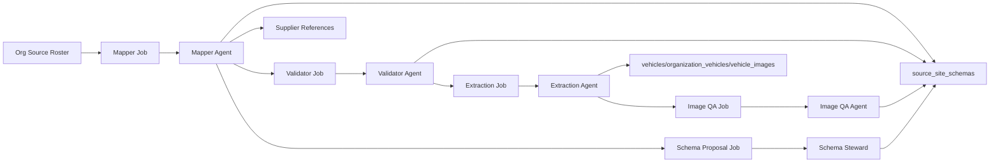

# Multi-Agent Ingestion Pipeline

This document explains how the mapper/validator/extraction agents coordinate via the new database plumbing (`source_site_schemas`, `ingestion_jobs`, and `supplier_references`).

---

## 1. Agent Roles

| Agent | Purpose | Input | Output |
| --- | --- | --- | --- |
| **Mapper (Opus 4.5)** | Inspect site, classify specialization, map every field, capture suppliers, record image include/exclude rules, propose schema extensions. | HTML/Markdown, roster entry, [schema brief](./SCHEMA_BRIEF.md), [prompt pack](./LLM_PROMPTS.md). | Updated `source_site_schemas.schema_data`, classification fields, job result payload, supplier references. |
| **Validator (cheaper LLM / rule-based)** | Re-run selectors, verify sample values, confirm supplier mentions, sanity-check image selectors. | Mapper output + fresh HTML fetch. | Confidence adjustments written back to `source_site_schemas` + job status updates. |
| **Schema Steward** | Review `schema_proposals`, create migrations, update documentation. See [Schema Evolution](./SCHEMA_EVOLUTION.md). | Mapper proposals stored in `source_site_schemas.schema_proposals`. | DDL migrations + approved proposals flagged as completed. |
| **Extraction Agent** | Run ingestion once schema marked trusted: create businesses (if needed), insert vehicles, link orgs, upload galleries. | Trusted schema entry. | Rows in `vehicles`, `organization_vehicles`, `vehicle_images`. |
| **Image QA Agent** | Analyze galleries for pollution/duplicates, trigger re-map if repeated issues appear. | Recent ingestion results + `image_rules`. | Updated `pollution_notes`, duplicate flags, escalations. |
| **Supplier Linker** | Turn `supplier_references` leads into org links or new org profiles. | Rows in `supplier_references`. | Linked org IDs or new businesses records + status updates. |

---

## 2. Job Coordination (`ingestion_jobs`)

Each agent run is represented by a row in `ingestion_jobs`.

### Table Summary
- `job_type`: `mapper`, `validator`, `extraction`, `schema_steward`, `image_qa`, `schema_proposal`.
- `status`: `queued`, `running`, `succeeded`, `failed`, `blocked`, `cancelled`.
- `priority`: Lower number = higher priority (default 5).
- `payload`: Agent-specific instruction packet (URL, org_id, schema snapshot).
- `result`: Structured output (selector summaries, error traces, metrics).
- `scheduled_for`: Timestamp when this job should become eligible.
- `attempt`: Retries performed.

### Flow

Scheduling loop:
1. Query `ingestion_jobs` for `status='queued'` ordered by `priority`, `scheduled_for`.
2. Agents claim jobs by switching status to `running` and stamping `started_at`.
3. Upon success/failure, update `status`, `completed_at`, `result`, and optionally enqueue follow-up jobs.

---

## 3. Supplier References

When the mapper encounters partner mentions, it should:
1. Write a summary into `source_site_schemas.supplier_references` (quick view).
2. Insert a row into `supplier_references`:
   - `organization_id`: the org being mapped.
   - `source_domain/source_url`: where the mention was found.
   - `supplier_name`, `supplier_domain`, `role`, `context_snippet`, `confidence`.
   - `ingestion_job_id`: mapper job that discovered it.

Statuses:
- `new`: awaiting triage.
- `in_review`: being examined by a curator or automated linker.
- `linked`: matched to an existing org (`linked_organization_id` populated) or new org created.
- `dismissed`: false positive / irrelevant reference.

Use `supplier_references` to seed new org profiles, power supplier network graphs, and feed targeted ingestion queues.

---

## 4. Trusted Schema Criteria

Extraction runs only when:
1. Latest mapper job succeeded within defined freshness window.
2. Validator job marked the schema as trusted (confidence >= 0.8).
3. No open `schema_proposals` awaiting steward review for that domain.
4. `image_rules` include explicit include/exclude selectors.

Otherwise, schedule remediation jobs (rerun mapper, escalate to steward, etc.).

---

## 5. Operational Tips

- Every job row should capture error text in `error_message` for rapid triage.
- Keep job payloads small (store large HTML blobs in object storage if needed).
- When building automation, follow this order:
  1. `mapper` job queued for orgs missing schemas/stale > 30 days.
  2. `validator` job queued automatically upon mapper success.
  3. `extraction` job queued when validator confidence is high.
  4. `image_qa` job queued after extraction to audit galleries.
  5. `schema_proposal` job queued whenever mapper suggests new tables.
- Slack/alerting can watch `ingestion_jobs` for `status='failed'` or `attempt >= 3`.

This pipeline keeps ingestion deterministic, observable, and extensible as we add more specialized agents.

