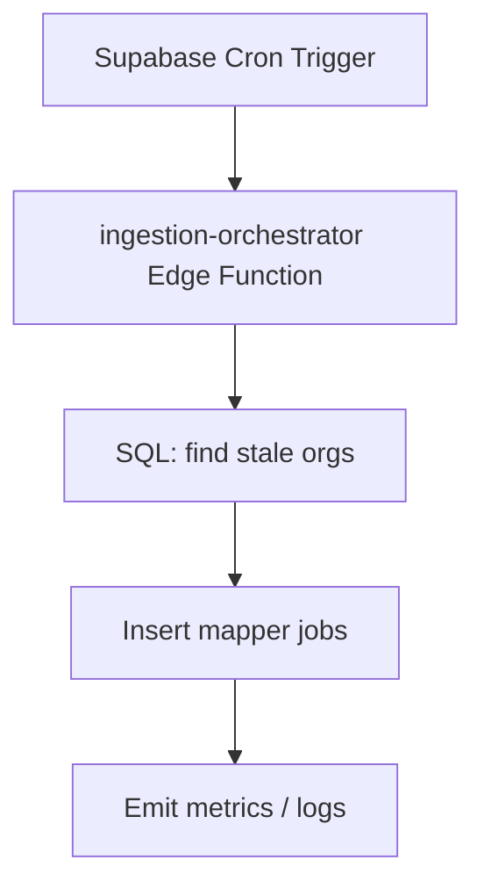

# Scheduling & Monitoring Playbook

We deploy ingestion agents continuously. This guide explains how to schedule runs, monitor health, and react when something drifts.

---

## 1. Scheduling Options

| Option | Use Case | Notes |
| --- | --- | --- |
| **Supabase Cron** | Lightweight recurring jobs (e.g., nightly mapper queue). | Create HTTP cron triggers that call a coordinator Edge Function which enqueues jobs into `ingestion_jobs`. |
| **GitHub Action** | Heavier workflows or when we need repo context (scripts, MCP). | Use `workflow_dispatch` + `cron` blocks to call CLI scripts (e.g., `scripts/run-ingestion-batch.ts`). |
| **Manual MCP/CLI** | One-off debugging or urgent backfills. | Run SQL from `docs/ingestion/ORG_SOURCE_ROSTER.md` to grab targets, then invoke the agents. |

### Recommended Cadence
- **Daily (night)**: Queue mapper jobs for orgs with stale/absent schemas (limit e.g., 30 per night).
- **Daily (offset)**: Run validator and extraction jobs generated from the previous mapper wave.
- **Weekly**: Re-run image QA on builders/fabricators where galleries change frequently.
- **Hourly**: Poll `ingestion_jobs` for failed jobs and retry/alert.

Pseudo-flow for a cron Edge Function:


---

## 2. Monitoring Queries

### Job Backlog
```sql
SELECT job_type, COUNT(*) AS queued_jobs
FROM ingestion_jobs
WHERE status = 'queued'
GROUP BY job_type
ORDER BY job_type;
```

### Failure Feed
```sql
SELECT job_type, organization_id, site_url, error_message, updated_at
FROM ingestion_jobs
WHERE status = 'failed'
ORDER BY updated_at DESC
LIMIT 50;
```

### Schema Freshness
```sql
SELECT domain, site_type, last_verified_at
FROM source_site_schemas
WHERE last_verified_at IS NULL OR last_verified_at < NOW() - INTERVAL '30 days'
ORDER BY last_verified_at NULLS FIRST;
```

### Image Pollution Watch
```sql
SELECT
  domain,
  jsonb_array_length(pollution_notes) AS pollution_events
FROM source_site_schemas
WHERE pollution_notes IS NOT NULL
  AND jsonb_array_length(pollution_notes) > 0
ORDER BY pollution_events DESC;
```

### Supplier Reference Aging
```sql
SELECT status, COUNT(*) AS refs
FROM supplier_references
GROUP BY status;
```

---

## 3. Alerting & Dashboards

- **Edge Logs**: Use Supabase dashboard or `supabase functions logs ingest-org-complete` for fast triage.
- **Grafana/Metabase** (todo): Pin the SQL above as charts.
- **Alert Conditions**:
  - `ingestion_jobs` failure count > 10 in last hour.
  - Mapper confidence < 0.7 more than 3 times for same domain.
  - Image pollution notes > 5 for same domain.
  - Supplier references stuck in `new` for > 7 days.

Send alerts to Slack/email with job metadata so engineers can react quickly.

---

## 4. Pollution Feedback Loop

1. Image QA job flags polluted gallery.
2. Append entry to `source_site_schemas.pollution_notes`.
3. Automatically queue a mapper job with `force_image_refresh=true`.
4. If the same selector fails 3+ times, escalate to manual inspection (Binary search the page, remove selectors).

---

## 5. Execution Checklist

- Keep cron/Action definitions in repo (versioned).
- Use service-role keys from Supabase secrets; never hardcode.
- After each deployment, run `supabase functions deploy ingest-org-complete` (already part of workflow) and confirm the scheduler still points to the latest version.
- When pausing ingestion (maintenance), set `status='blocked'` on queued jobs to avoid accidental execution.

See `[docs/ingestion/AGENT_PIPELINE.md](./AGENT_PIPELINE.md)` for orchestration details and `[docs/ingestion/MODEL_STRATEGY.md](./MODEL_STRATEGY.md)` for cost tiers.

