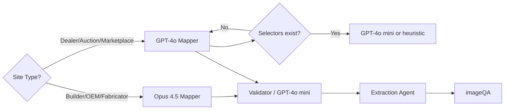

# Model Strategy

We balance accuracy and cost by assigning each task a model tier. Opus 4.5 handles deep reasoning; smaller models (GPT-4o mini / Claude Haiku / local heuristics) handle validation and bulk work.

---

## 1. Tiering Matrix

| Task | Default Model | Why | Downgrade Path |
| --- | --- | --- | --- |
| Initial site mapping for builders, OEMs, fabrication shops | **Opus 4.5** | Needs deep reasoning, supplier detection, schema proposals. | None (unless site already mapped recently). |
| Mapping for standard dealers/marketplaces with known CMS | GPT-4o (standard) | Structures are predictable, prompts already tuned. | Fallback to GPT-4o mini or rule-based scraper once selectors verified. |
| Validator checks (field/value verification) | GPT-4o mini or Claude Haiku | Lightweight reasoning with quick turn-around. | Eventually rule-based + heuristics when confidence is high. |
| Extraction agent | Deterministic code | Reads selectors from `source_site_schemas`. | LLM only if fallback/heuristic fails. |
| Schema proposal summarization | Opus 4.5 | Complex reasoning about DB design. | After enough templates exist, fine-tune or switch to GPT-4o standard. |
| Supplier reference triage | GPT-4o mini | Only needs to parse text snippet and categorize supplier role. | Promote to deterministic string matching when pattern is fixed. |

---

## 2. Decision Flow

---

## 3. Cost Controls

- Track mapper job counts per domain + model. Store model choice inside `ingestion_jobs.payload`.
- Implement cutoffs: e.g., after 3 Opus runs for a domain within 7 days, block new runs unless schema changed.
- Capture latency + token metrics (available via provider dashboards) once per week to adjust thresholds.
- Build a backlog of “selector recipes” so cheaper models can reuse them without hitting Opus again.

---

## 4. When to Upgrade / Downgrade

**Upgrade to Opus 4.5 when:**
- Site adds new sections (maintenance logs, supplier network).
- Validator repeatedly flags mismatches at lower tiers.
- Mapper needs to generate significant schema proposals.

**Downgrade when:**
- Schema is stable and extraction agents run without pollution.
- Validator success rate > 95% for last 10 runs.
- Supplier references follow predictable DOM patterns (move to regex).

Document the chosen tier in the job `payload.model_hint` so schedulers can reason about budget.

