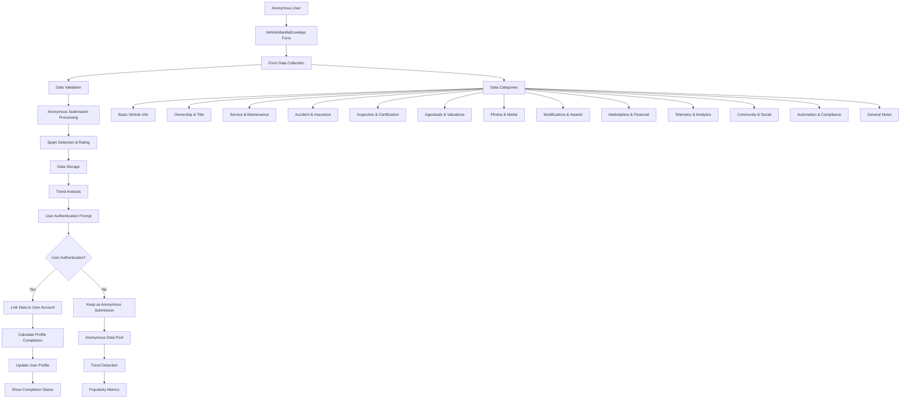

# Vehicle Data Pipeline Roadmap

## Overview

This document outlines the complete data pipeline for the Vehicle Digital Profile system, from initial user input through database storage and profile completion tracking.

## Current Architecture

### 1. Data Entry Layer
- **VehicleManillaEnvelope.tsx**: Comprehensive form with 12 data categories
- **Fields**: 50+ individual data points covering traditional and cutting-edge vehicle information
- **Current State**: Form data stored in React state, logged to console on submit

### 2. Database Schema (Supabase)
- **vehicles**: Core vehicle data with user_id linkage
- **profiles**: User profiles with completion tracking
- **vehicle_timeline**: Immutable event history
- **vehicle_images**: Visual documentation
- **Additional tables**: service_records, skills, achievements, etc.

### 3. User Authentication & Profile System
- **Supabase Auth**: User registration and session management
- **Profile Completion**: Onboarding step tracking (0-100%)
- **User Types**: viewer, professional with different capabilities

## Data Pipeline Flow



## Anonymous Submission Strategy

### Core Philosophy: "Accept First, Validate Later"
- **Goal**: Build critical mass by accepting partial/incomplete submissions
- **Strategy**: Use data patterns and trends to identify legitimate vs. spam submissions
- **Benefit**: Helps illiterate users participate and builds comprehensive database

### Anonymous Submission Flow
```
Anonymous User → Partial Form Fill → Submit → 
Data Rating & Spam Detection → Storage → 
Trend Analysis → Authentication Prompt → 
User Choice (Login/Skip) → Data Processing
```

### Data Rating System

#### Submission Quality Tiers
| Tier | Description | Criteria | Action |
|------|-------------|----------|---------|
| **Grail** | Exceptional quality | Complete data, verified sources, unique vehicle | Premium features, featured placement |
| **Legit** | Good quality | Substantial data, reasonable completeness | Standard processing, user benefits |
| **Partial** | Acceptable quality | Basic info provided, some missing fields | Basic storage, encourage completion |
| **Suspicious** | Potential spam | Incomplete, repetitive patterns | Flagged for review, limited features |
| **Spam** | Clear spam | Bot patterns, fake data, malicious intent | Blocked, IP flagged |

#### Rating Algorithm
```typescript
interface SubmissionRating {
  tier: 'grail' | 'legit' | 'partial' | 'suspicious' | 'spam';
  score: number; // 0-100
  confidence: number; // 0-1
  flags: string[];
  recommendations: string[];
}

function rateSubmission(formData: VehicleFormData, userContext: UserContext): SubmissionRating {
  let score = 0;
  const flags: string[] = [];
  const recommendations: string[] = [];

  // Data completeness scoring (40% of total)
  const completeness = calculateCompleteness(formData);
  score += completeness * 0.4;

  // Data quality scoring (30% of total)
  const quality = assessDataQuality(formData);
  score += quality * 0.3;

  // User behavior scoring (20% of total)
  const behavior = analyzeUserBehavior(userContext);
  score += behavior * 0.2;

  // Trend analysis scoring (10% of total)
  const trendScore = analyzeTrends(formData);
  score += trendScore * 0.1;

  // Determine tier
  let tier: SubmissionRating['tier'];
  if (score >= 90) tier = 'grail';
  else if (score >= 70) tier = 'legit';
  else if (score >= 40) tier = 'partial';
  else if (score >= 20) tier = 'suspicious';
  else tier = 'spam';

  return {
    tier,
    score: Math.round(score),
    confidence: calculateConfidence(formData, userContext),
    flags,
    recommendations
  };
}
```

### Spam Detection System

#### Detection Methods
1. **Pattern Recognition**
   - Repeated submissions from same IP
   - Identical data across multiple submissions
   - Bot-like behavior patterns

2. **Data Quality Analysis**
   - Impossible vehicle combinations
   - Invalid VIN patterns
   - Suspicious text patterns

3. **User Behavior Analysis**
   - Submission frequency
   - Time spent on form
   - Mouse/keyboard patterns

4. **Content Analysis**
   - Text similarity to known spam
   - Suspicious keywords
   - Unrealistic descriptions

#### Trend Analysis Benefits
```
Spam Detection → Trend Identification → Market Intelligence
     ↓                    ↓                    ↓
Block malicious    Popular models/     Business insights
submissions        features trending   for partnerships
```

### Anonymous Data Storage

#### Database Schema for Anonymous Submissions
```sql
-- Anonymous submissions table
CREATE TABLE anonymous_submissions (
  id UUID PRIMARY KEY DEFAULT uuid_generate_v4(),
  
  -- Form data (all categories)
  make TEXT,
  model TEXT,
  year INTEGER,
  vin TEXT,
  color TEXT,
  mileage INTEGER,
  engine TEXT,
  transmission TEXT,
  drivetrain TEXT,
  status TEXT,
  
  -- Ownership & Title
  current_owner TEXT,
  previous_owners JSONB,
  title_number TEXT,
  title_state TEXT,
  purchase_date DATE,
  purchase_price DECIMAL(10,2),
  
  -- Service & Maintenance
  service_records TEXT,
  maintenance_logs TEXT,
  warranty_info TEXT,
  next_service_date DATE,
  
  -- Accident & Insurance
  accident_reports TEXT,
  insurance_claims TEXT,
  insurance_provider TEXT,
  policy_number TEXT,
  
  -- Inspection & Certification
  inspection_certificates TEXT,
  emissions_tests TEXT,
  recall_notices TEXT,
  
  -- Appraisals & Valuations
  appraisal_documents TEXT,
  market_value DECIMAL(10,2),
  auction_results TEXT,
  dealer_offers TEXT,
  
  -- Photos & Media
  photo_notes TEXT,
  video_notes TEXT,
  scan_notes TEXT,
  
  -- Modifications & Awards
  modification_records TEXT,
  customization_details TEXT,
  awards_certificates TEXT,
  show_wins TEXT,
  
  -- Marketplace & Financial
  marketplace_listings TEXT,
  auction_participation TEXT,
  investment_opportunities TEXT,
  
  -- Telemetry & Analytics
  obd_logs TEXT,
  gps_history TEXT,
  diagnostics TEXT,
  performance_metrics TEXT,
  custom_analytics TEXT,
  
  -- Community & Social
  comments_discussion TEXT,
  engagement_metrics TEXT,
  owner_profile TEXT,
  reputation_followers TEXT,
  
  -- Automation & Compliance
  automated_reminders TEXT,
  smart_contracts TEXT,
  compliance_records TEXT,
  
  -- General Notes
  general_notes TEXT,
  
  -- Submission metadata
  submission_rating JSONB NOT NULL,
  ip_address INET,
  user_agent TEXT,
  session_id TEXT,
  fingerprint_hash TEXT,
  
  -- Processing status
  status TEXT DEFAULT 'pending' CHECK (status IN ('pending', 'processed', 'flagged', 'blocked')),
  processed_at TIMESTAMP WITH TIME ZONE,
  
  -- Trend analysis
  trend_score DECIMAL(3,2),
  popularity_metrics JSONB,
  
  -- Timestamps
  created_at TIMESTAMP WITH TIME ZONE DEFAULT NOW(),
  updated_at TIMESTAMP WITH TIME ZONE DEFAULT NOW()
);

-- Trend analysis table
CREATE TABLE vehicle_trends (
  id UUID PRIMARY KEY DEFAULT uuid_generate_v4(),
  
  -- Trend identification
  trend_type TEXT NOT NULL, -- 'make', 'model', 'feature', 'modification'
  trend_value TEXT NOT NULL,
  time_period TEXT NOT NULL, -- 'daily', 'weekly', 'monthly'
  
  -- Metrics
  submission_count INTEGER DEFAULT 0,
  unique_users INTEGER DEFAULT 0,
  average_rating DECIMAL(3,2),
  spam_ratio DECIMAL(3,2),
  
  -- Timestamps
  period_start TIMESTAMP WITH TIME ZONE,
  period_end TIMESTAMP WITH TIME ZONE,
  created_at TIMESTAMP WITH TIME ZONE DEFAULT NOW()
);

-- User fingerprinting for spam detection
CREATE TABLE user_fingerprints (
  id UUID PRIMARY KEY DEFAULT uuid_generate_v4(),
  fingerprint_hash TEXT UNIQUE NOT NULL,
  
  -- Activity tracking
  submission_count INTEGER DEFAULT 0,
  last_submission TIMESTAMP WITH TIME ZONE,
  first_seen TIMESTAMP WITH TIME ZONE DEFAULT NOW(),
  
  -- Reputation
  spam_score DECIMAL(3,2) DEFAULT 0,
  trust_level TEXT DEFAULT 'unknown' CHECK (trust_level IN ('unknown', 'trusted', 'suspicious', 'blocked')),
  
  -- Metadata
  ip_addresses INET[],
  user_agents TEXT[]
);
```

### User Experience for Anonymous Submissions

#### Submission Flow
1. **Form Fill**: User fills out whatever they can/want
2. **Submit**: No authentication required initially
3. **Rating Display**: Show submission quality and suggestions
4. **Authentication Prompt**: Encourage account creation
5. **Data Processing**: Store and analyze regardless of authentication

#### Feedback System
```typescript
interface SubmissionFeedback {
  rating: SubmissionRating;
  suggestions: string[];
  benefits: string[];
  nextSteps: string[];
}

function generateFeedback(rating: SubmissionRating): SubmissionFeedback {
  const suggestions = [];
  const benefits = [];
  const nextSteps = [];

  switch (rating.tier) {
    case 'grail':
      benefits.push('Your submission is exceptional!');
      benefits.push('Eligible for featured placement');
      nextSteps.push('Create account to claim ownership');
      break;
    case 'legit':
      benefits.push('Good quality submission');
      benefits.push('Access to community features');
      suggestions.push('Add more photos for better rating');
      nextSteps.push('Complete profile for full access');
      break;
    case 'partial':
      suggestions.push('Add basic vehicle information');
      suggestions.push('Include VIN if available');
      benefits.push('Data saved for future completion');
      nextSteps.push('Return later to add more details');
      break;
    case 'suspicious':
      suggestions.push('Please provide more details');
      suggestions.push('Verify vehicle information');
      nextSteps.push('Contact support if legitimate');
      break;
  }

  return { rating, suggestions, benefits, nextSteps };
}
```

## Data Categories & Completion Tracking

### Category Weighting System
Each data category contributes to the overall profile completion percentage:

| Category | Weight | Required Fields | Optional Fields |
|----------|--------|-----------------|-----------------|
| Basic Vehicle Info | 15% | make, model, year, vin | color, mileage, engine, transmission, drivetrain, status |
| Ownership & Title | 12% | currentOwner, titleNumber | previousOwners, titleState, purchaseDate, purchasePrice |
| Service & Maintenance | 10% | serviceRecords | maintenanceLogs, warrantyInfo, nextServiceDate |
| Accident & Insurance | 8% | accidentReports | insuranceClaims, insuranceProvider, policyNumber |
| Inspection & Certification | 8% | inspectionCertificates | emissionsTests, recallNotices |
| Appraisals & Valuations | 8% | appraisalDocuments | marketValue, auctionResults, dealerOffers |
| Photos & Media | 7% | photoNotes | videoNotes, scanNotes |
| Modifications & Awards | 7% | modificationRecords | customizationDetails, awardsCertificates, showWins |
| Marketplace & Financial | 7% | marketplaceListings | auctionParticipation, investmentOpportunities |
| Telemetry & Analytics | 6% | obdLogs | gpsHistory, diagnostics, performanceMetrics, customAnalytics |
| Community & Social | 6% | commentsDiscussion | engagementMetrics, ownerProfile, reputationFollowers |
| Automation & Compliance | 6% | automatedReminders | smartContracts, complianceRecords |
| General Notes | 0% | - | generalNotes |

**Total: 100%**

### Completion Calculation Logic
```typescript
interface CompletionCalculation {
  category: string;
  weight: number;
  requiredFields: string[];
  optionalFields: string[];
  completion: number; // 0-100%
}

function calculateProfileCompletion(formData: VehicleFormData): number {
  const categories: CompletionCalculation[] = [
    {
      category: 'basic',
      weight: 15,
      requiredFields: ['make', 'model', 'year', 'vin'],
      optionalFields: ['color', 'mileage', 'engine', 'transmission', 'drivetrain', 'status'],
      completion: 0
    },
    // ... other categories
  ];

  let totalCompletion = 0;

  categories.forEach(category => {
    const requiredComplete = category.requiredFields.every(field => 
      formData[field] && formData[field].trim() !== ''
    );
    
    const optionalComplete = category.optionalFields.filter(field => 
      formData[field] && formData[field].trim() !== ''
    ).length / category.optionalFields.length;

    category.completion = requiredComplete ? 
      (0.7 + (optionalComplete * 0.3)) * 100 : 0;
    
    totalCompletion += (category.completion * category.weight) / 100;
  });

  return Math.round(totalCompletion);
}
```

## Implementation Roadmap

### Phase 1: Anonymous Submission System (Immediate)
1. **Anonymous Form Submission**
   - Allow form submission without authentication
   - Collect IP address and user fingerprint
   - Store data in anonymous_submissions table

2. **Basic Rating System**
   - Implement submission quality scoring
   - Basic spam detection
   - Store rating with submission

3. **User Feedback**
   - Show submission quality to user
   - Provide suggestions for improvement
   - Encourage account creation

### Phase 2: Spam Detection & Trend Analysis (Short-term)
1. **Advanced Spam Detection**
   - Pattern recognition algorithms
   - User behavior analysis
   - Content quality assessment

2. **Trend Analysis**
   - Track popular vehicles/features
   - Identify trending modifications
   - Generate market intelligence

3. **Data Quality Improvement**
   - Flag suspicious submissions
   - Provide data validation feedback
   - Encourage legitimate submissions

### Phase 3: User Authentication Integration (Medium-term)
1. **Account Linking**
   - Link anonymous submissions to user accounts
   - Merge duplicate submissions
   - Maintain submission history

2. **Profile Completion**
   - Calculate completion percentage
   - Update user profile with completion status
   - Show completion progress

3. **Community Features**
   - Vehicle sharing and discovery
   - Owner verification system
   - Community reputation building

### Phase 4: Advanced Features (Long-term)
1. **AI-Powered Analysis**
   - Auto-completion suggestions based on trends
   - Data validation using AI
   - Market value predictions

2. **Integration Capabilities**
   - VIN decoder APIs
   - Insurance company APIs
   - Service history aggregation

3. **Advanced Analytics**
   - Vehicle value trends
   - Ownership patterns
   - Market analysis

## Database Schema Updates Needed

### 1. Anonymous Submissions Table
```sql
CREATE TABLE anonymous_submissions (
  id UUID PRIMARY KEY DEFAULT uuid_generate_v4(),
  
  -- Form data (all categories)
  make TEXT,
  model TEXT,
  year INTEGER,
  vin TEXT,
  color TEXT,
  mileage INTEGER,
  engine TEXT,
  transmission TEXT,
  drivetrain TEXT,
  status TEXT,
  
  -- Ownership & Title
  current_owner TEXT,
  previous_owners JSONB,
  title_number TEXT,
  title_state TEXT,
  purchase_date DATE,
  purchase_price DECIMAL(10,2),
  
  -- Service & Maintenance
  service_records TEXT,
  maintenance_logs TEXT,
  warranty_info TEXT,
  next_service_date DATE,
  
  -- Accident & Insurance
  accident_reports TEXT,
  insurance_claims TEXT,
  insurance_provider TEXT,
  policy_number TEXT,
  
  -- Inspection & Certification
  inspection_certificates TEXT,
  emissions_tests TEXT,
  recall_notices TEXT,
  
  -- Appraisals & Valuations
  appraisal_documents TEXT,
  market_value DECIMAL(10,2),
  auction_results TEXT,
  dealer_offers TEXT,
  
  -- Photos & Media
  photo_notes TEXT,
  video_notes TEXT,
  scan_notes TEXT,
  
  -- Modifications & Awards
  modification_records TEXT,
  customization_details TEXT,
  awards_certificates TEXT,
  show_wins TEXT,
  
  -- Marketplace & Financial
  marketplace_listings TEXT,
  auction_participation TEXT,
  investment_opportunities TEXT,
  
  -- Telemetry & Analytics
  obd_logs TEXT,
  gps_history TEXT,
  diagnostics TEXT,
  performance_metrics TEXT,
  custom_analytics TEXT,
  
  -- Community & Social
  comments_discussion TEXT,
  engagement_metrics TEXT,
  owner_profile TEXT,
  reputation_followers TEXT,
  
  -- Automation & Compliance
  automated_reminders TEXT,
  smart_contracts TEXT,
  compliance_records TEXT,
  
  -- General Notes
  general_notes TEXT,
  
  -- Submission metadata
  submission_rating JSONB NOT NULL,
  ip_address INET,
  user_agent TEXT,
  session_id TEXT,
  fingerprint_hash TEXT,
  
  -- Processing status
  status TEXT DEFAULT 'pending' CHECK (status IN ('pending', 'processed', 'flagged', 'blocked')),
  processed_at TIMESTAMP WITH TIME ZONE,
  
  -- Trend analysis
  trend_score DECIMAL(3,2),
  popularity_metrics JSONB,
  
  -- Timestamps
  created_at TIMESTAMP WITH TIME ZONE DEFAULT NOW(),
  updated_at TIMESTAMP WITH TIME ZONE DEFAULT NOW()
);
```

### 2. Vehicle Profile Table (for authenticated users)
```sql
CREATE TABLE vehicle_profiles (
  id UUID PRIMARY KEY DEFAULT uuid_generate_v4(),
  vehicle_id UUID REFERENCES vehicles(id) ON DELETE CASCADE,
  user_id UUID REFERENCES auth.users(id),
  
  -- All form fields (same as anonymous_submissions)
  -- ... (same fields as above)
  
  -- Metadata
  completion_percentage INTEGER DEFAULT 0,
  submission_rating JSONB,
  anonymous_submission_id UUID REFERENCES anonymous_submissions(id),
  last_updated TIMESTAMP WITH TIME ZONE DEFAULT NOW(),
  created_at TIMESTAMP WITH TIME ZONE DEFAULT NOW(),
  
  UNIQUE(vehicle_id, user_id)
);
```

### 3. Trend Analysis Tables
```sql
-- Vehicle trends
CREATE TABLE vehicle_trends (
  id UUID PRIMARY KEY DEFAULT uuid_generate_v4(),
  trend_type TEXT NOT NULL, -- 'make', 'model', 'feature', 'modification'
  trend_value TEXT NOT NULL,
  time_period TEXT NOT NULL, -- 'daily', 'weekly', 'monthly'
  submission_count INTEGER DEFAULT 0,
  unique_users INTEGER DEFAULT 0,
  average_rating DECIMAL(3,2),
  spam_ratio DECIMAL(3,2),
  period_start TIMESTAMP WITH TIME ZONE,
  period_end TIMESTAMP WITH TIME ZONE,
  created_at TIMESTAMP WITH TIME ZONE DEFAULT NOW(),
  UNIQUE(trend_type, trend_value, time_period, period_start)
);

-- User fingerprints for spam detection
CREATE TABLE user_fingerprints (
  id UUID PRIMARY KEY DEFAULT uuid_generate_v4(),
  fingerprint_hash TEXT UNIQUE NOT NULL,
  submission_count INTEGER DEFAULT 0,
  last_submission TIMESTAMP WITH TIME ZONE,
  first_seen TIMESTAMP WITH TIME ZONE DEFAULT NOW(),
  spam_score DECIMAL(3,2) DEFAULT 0,
  trust_level TEXT DEFAULT 'unknown' CHECK (trust_level IN ('unknown', 'trusted', 'suspicious', 'blocked')),
  ip_addresses INET[],
  user_agents TEXT[]
);
```

## User Experience Flow

### 1. Anonymous User Journey (Updated)
```
Anonymous User → VehicleManillaEnvelope Form → Fill Partial Data → Submit → 
Data Rating & Spam Detection → Show Quality Feedback → 
Authentication Prompt → User Choice (Login/Skip) → 
Data Saved & Processed → Trend Analysis → 
"Vehicle XYZ is 67% complete" → Dashboard Access (if authenticated)
```

### 2. Authenticated User Journey
```
Authenticated User → VehicleManillaEnvelope Form → Fill Data → Submit → 
Vehicle Saved → Completion Updated → Profile Dashboard → 
"Vehicle XYZ is 67% complete" → Continue Editing or Add Another Vehicle
```

### 3. Profile Dashboard Display
```
User Profile:
├── Vehicle Portfolio
│   ├── Vehicle A: 89% complete (Grail Quality)
│   ├── Vehicle B: 67% complete (Legit Quality)  
│   └── Vehicle C: 23% complete (Partial Quality)
├── Overall Completion: 60%
├── Recent Activity
├── Trend Insights
│   ├── "Dodge Charger trending +45% this month"
│   └── "Your modifications are popular"
└── Completion Suggestions
```

## Technical Implementation Steps

### Step 1: Update VehicleManillaEnvelope Component
```typescript
// Allow anonymous submissions
const handleSubmit = async (e: React.FormEvent) => {
  e.preventDefault();
  
  // Collect user context for spam detection
  const userContext = {
    ipAddress: await getClientIP(),
    userAgent: navigator.userAgent,
    sessionId: getSessionId(),
    fingerprint: await generateFingerprint()
  };
  
  // Rate the submission
  const rating = rateSubmission(formData, userContext);
  
  // Save anonymous submission
  const { data, error } = await supabase
    .from('anonymous_submissions')
    .insert({
      ...formData,
      submission_rating: rating,
      ip_address: userContext.ipAddress,
      user_agent: userContext.userAgent,
      session_id: userContext.sessionId,
      fingerprint_hash: userContext.fingerprint
    });
    
  if (error) {
    toast.error('Failed to save vehicle data');
    return;
  }
  
  // Show feedback to user
  const feedback = generateFeedback(rating);
  showSubmissionFeedback(feedback);
  
  // Prompt for authentication
  promptForAuthentication(data.id);
};
```

### Step 2: Create Rating and Spam Detection Service
```typescript
// services/submissionRating.ts
export class SubmissionRatingService {
  static rateSubmission(formData: VehicleFormData, userContext: UserContext): SubmissionRating {
    // Implementation of rating algorithm
  }
  
  static detectSpam(formData: VehicleFormData, userContext: UserContext): SpamDetection {
    // Implementation of spam detection
  }
  
  static analyzeTrends(formData: VehicleFormData): TrendAnalysis {
    // Implementation of trend analysis
  }
}
```

### Step 3: Create Trend Analysis Service
```typescript
// services/trendAnalysis.ts
export class TrendAnalysisService {
  static async updateTrends(submission: AnonymousSubmission) {
    // Update trend data based on submission
  }
  
  static async getPopularVehicles(timePeriod: string) {
    // Get trending vehicles
  }
  
  static async getMarketInsights() {
    // Generate market intelligence
  }
}
```

## Success Metrics

### 1. User Engagement
- Anonymous submission rate
- Form completion rate (partial vs. complete)
- Authentication conversion rate
- Return visits to complete profile

### 2. Data Quality
- Average submission rating
- Spam detection accuracy
- Trend identification accuracy
- Data validation success rate

### 3. System Performance
- Submission processing speed
- Spam detection latency
- Trend analysis accuracy
- Database operation efficiency

### 4. Business Intelligence
- Popular vehicle trends
- Market demand indicators
- User behavior patterns
- Spam pattern evolution

## Future Enhancements

### 1. AI-Powered Features
- Auto-completion suggestions based on trends
- Data validation using AI
- Market value predictions
- Spam pattern learning

### 2. Integration Capabilities
- VIN decoder APIs
- Insurance company APIs
- Service history aggregation
- Market data feeds

### 3. Advanced Analytics
- Vehicle value trends
- Ownership patterns
- Market analysis
- Predictive maintenance

### 4. Community Features
- Vehicle sharing and discovery
- Owner verification system
- Community reputation building
- Trend-based recommendations

## Conclusion

This updated roadmap provides a comprehensive plan for building a vehicle database through accepting anonymous submissions while maintaining data quality through intelligent rating and spam detection systems. The approach balances accessibility for all users with the need for data integrity, creating a foundation for both individual user profiles and broader market intelligence.

The system will evolve from accepting partial submissions to building a comprehensive vehicle digital identity platform that serves both individual users and the broader automotive community, while providing valuable insights into vehicle trends and market dynamics. 